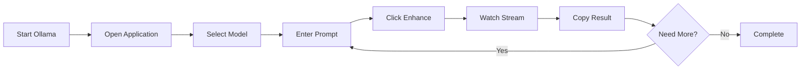
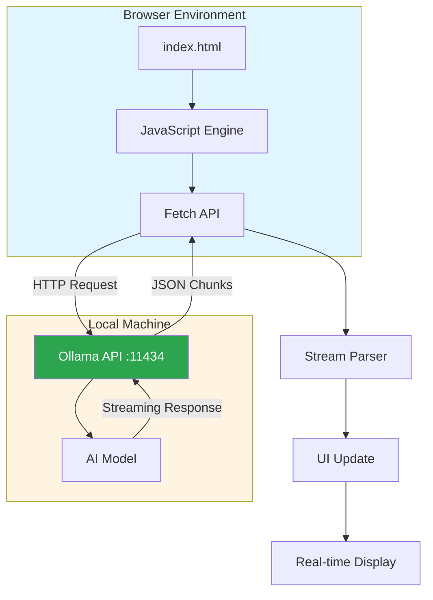
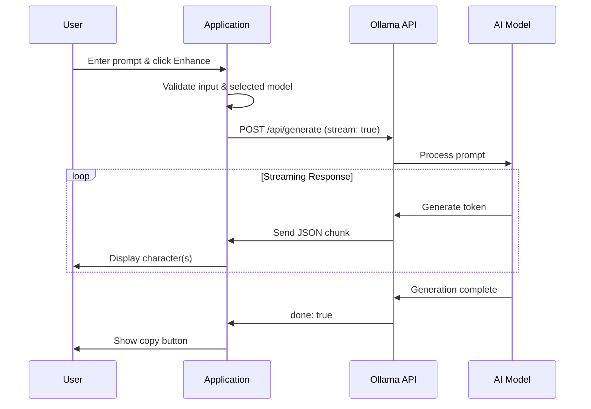

# xsukax Ollama AI Prompt Generator

[](https://www.gnu.org/licenses/gpl-3.0)
[](https://xsukax.github.io/xsukax-Ollama-AI-Prompt-Generator)
[](https://github.com/xsukax/xsukax-Ollama-AI-Prompt-Generator)

A lightweight, privacy-focused web application that enhances AI prompts using locally-running Ollama models with real-time streaming output.

**🔗 Live Demo:** [https://xsukax.github.io/xsukax-Ollama-AI-Prompt-Generator](https://xsukax.github.io/xsukax-Ollama-AI-Prompt-Generator)

## 📋 Project Overview

xsukax Ollama AI Prompt Generator is a single-file HTML application designed to transform basic AI prompts into sophisticated, well-engineered prompts that yield superior results from AI language models. The application leverages the Ollama API to access locally-installed AI models, providing prompt engineering expertise without requiring cloud services or external API keys.

Built with modern web technologies, this tool features real-time streaming output, allowing users to see enhanced prompts generated character-by-character as the AI processes their input. The application maintains a clean, GitHub-inspired interface that emphasizes usability and professional aesthetics.

**Key Characteristics:**
- **Single-file deployment** - Entire application contained in `index.html`
- **Local-first architecture** - Connects to Ollama running on localhost
- **Real-time streaming** - Instant visual feedback during prompt generation
- **Model flexibility** - Works with any Ollama-compatible model
- **Zero dependencies** - No external libraries or frameworks required beyond Font Awesome for icons

## 🔒 Security and Privacy Benefits

This application prioritizes user privacy and security through its architecture and implementation:

### Complete Data Privacy
- **No external data transmission** - All prompt processing occurs locally on your machine through Ollama
- **No cloud dependencies** - Does not connect to third-party AI services or APIs
- **No data collection** - The application stores no user data, analytics, or telemetry
- **No authentication required** - No user accounts, passwords, or personal information needed

### Client-Side Security
- **Browser-based execution** - All processing happens within the user's browser environment
- **No server-side code** - Eliminates server-side vulnerabilities and attack vectors
- **Direct API communication** - Communicates directly with local Ollama instance (localhost:11434)
- **CORS-safe implementation** - Properly handles cross-origin requests for local API access

### Transparency and Auditability
- **Open-source codebase** - Complete source code available for security auditing
- **Single-file architecture** - Easy to review and verify all application logic
- **No obfuscation** - Clear, readable JavaScript without minification or compilation
- **No hidden network requests** - All API calls are explicit and documented in code

### Local Model Control
- **User-controlled AI models** - Only uses models you've explicitly downloaded via Ollama
- **No model telemetry** - Models run entirely offline without external connections
- **Model version control** - Full control over which model versions are used

## ✨ Features and Advantages

### Core Functionality
- **Real-Time Streaming Output** - Watch enhanced prompts generate in real-time rather than waiting for completion
- **Dynamic Model Discovery** - Automatically detects and lists all available Ollama models
- **Intelligent Prompt Enhancement** - Leverages AI expertise to improve prompt clarity, specificity, and effectiveness
- **One-Click Copy** - Instantly copy enhanced prompts to clipboard with visual confirmation
- **Connection Status Monitoring** - Real-time indication of Ollama API connectivity

### User Experience
- **GitHub-Inspired Design** - Clean, professional interface familiar to developers
- **Responsive Layout** - Optimized for desktop and mobile viewing
- **Visual Streaming Indicator** - Pulsing animation shows when AI is actively generating
- **Auto-Scrolling Output** - Enhanced prompt area automatically scrolls during streaming
- **Error Handling** - Clear, actionable error messages for troubleshooting

### Technical Advantages
- **Zero Installation** - Simply open `index.html` in any modern browser
- **No Backend Required** - Runs entirely in the browser without server infrastructure
- **Cross-Platform Compatibility** - Works on Windows, macOS, Linux wherever Ollama runs
- **Lightweight Performance** - Minimal resource consumption with efficient streaming implementation
- **Easy Customization** - Single HTML file makes modifications straightforward

### Unique Differentiators
- **Privacy-first approach** - Unlike cloud-based prompt enhancers, all data stays local
- **Model agnostic** - Works with any Ollama model (LLaMA, Mistral, CodeLLaMA, etc.)
- **No API costs** - Free to use with your own Ollama installation
- **Offline capable** - Functions without internet connection (Ollama runs locally)
- **Streaming architecture** - Provides immediate feedback unlike batch-processing alternatives

## 📦 Installation Instructions

### Prerequisites

1. **Ollama Installation**
   - Download and install Ollama from [https://ollama.ai](https://ollama.ai)
   - Supported platforms: Windows, macOS, Linux
   - Verify installation by running `ollama --version` in terminal

2. **Download AI Models**
   ```bash
   # Example: Install LLaMA 2 model
   ollama pull llama2
   
   # Or install Mistral
   ollama pull mistral
   
   # View installed models
   ollama list
   ```

3. **Modern Web Browser**
   - Chrome 90+, Firefox 88+, Safari 14+, or Edge 90+
   - JavaScript must be enabled
   - Clipboard API support for copy functionality

### Application Setup

#### Method 1: Direct Download
1. Download `index.html` from the repository
2. Save to a location on your computer
3. Double-click `index.html` to open in your default browser

#### Method 2: Clone Repository
```bash
# Clone the repository
git clone https://github.com/xsukax/xsukax-Ollama-AI-Prompt-Generator.git

# Navigate to directory
cd xsukax-Ollama-AI-Prompt-Generator

# Open in browser (example for different platforms)
# Windows
start index.html

# macOS
open index.html

# Linux
xdg-open index.html
```

#### Method 3: Use Live Demo
- Visit [https://xsukax.github.io/xsukax-Ollama-AI-Prompt-Generator](https://xsukax.github.io/xsukax-Ollama-AI-Prompt-Generator)
- Requires Ollama running locally (see CORS configuration below)

### Ollama Configuration

#### Starting Ollama Service
```bash
# Start Ollama (runs on localhost:11434 by default)
ollama serve
```

#### CORS Configuration (For Live Demo Access)
If using the GitHub Pages demo, configure Ollama to accept browser requests:

**On macOS/Linux:**
```bash
# Set environment variable for CORS
export OLLAMA_ORIGINS="https://xsukax.github.io"
ollama serve
```

**On Windows (PowerShell):**
```powershell
$env:OLLAMA_ORIGINS="https://xsukax.github.io"
ollama serve
```

**On Windows (Command Prompt):**
```cmd
set OLLAMA_ORIGINS=https://xsukax.github.io
ollama serve
```

### No PHP Configuration Required

This application is a **client-side only** HTML/JavaScript application and does not require PHP or server-side configuration. All processing occurs in the browser, connecting directly to your local Ollama instance. No `php.ini` modifications or PHP installation is necessary.

### Verification

1. Ensure Ollama is running: `curl http://localhost:11434/api/tags`
2. Open the application in your browser
3. Check the status indicator shows "Connected to Ollama" (green dot)
4. Verify models appear in the sidebar

## 📖 Usage Guide

### Basic Workflow



### Step-by-Step Instructions

#### 1. Launch Ollama Service
```bash
# In terminal/command prompt
ollama serve
```
Keep this terminal window open while using the application.

#### 2. Open the Application
- Double-click `index.html` or visit the live demo
- Verify connection status shows green indicator

#### 3. Select an AI Model
- View available models in the left sidebar
- Click on any model to select it (highlighted in blue)
- Models display their size for reference
- Use "Refresh Models" button if newly downloaded models don't appear

#### 4. Enter Your Original Prompt
- Type or paste your prompt in the "Original Prompt" textarea
- Example: `Write a story about a robot learning to paint`
- No length restrictions, but concise prompts work best

#### 5. Generate Enhanced Prompt
- Click the "Enhance Prompt" button
- Watch real-time streaming in the "Enhanced Prompt" section
- Pulsing indicator shows active generation
- Text auto-scrolls as it generates

#### 6. Copy Enhanced Prompt
- Click the "Copy" button (top-right of Enhanced Prompt section)
- Visual confirmation shows "Copied!" with green checkmark
- Use enhanced prompt in your preferred AI tool

### Application Architecture



### Streaming Process Flow



### Advanced Usage

#### Switching Models
Different models excel at different tasks:
- **llama2** - General purpose, balanced performance
- **mistral** - Strong reasoning and instruction following
- **codellama** - Optimized for code and technical prompts
- **neural-chat** - Conversational and creative tasks

#### Iterative Refinement
1. Generate initial enhanced prompt
2. Use enhanced prompt as new input
3. Click "Enhance Prompt" again for further refinement
4. Repeat until desired quality achieved

#### Troubleshooting Common Issues

| Issue | Solution |
|-------|----------|
| Red status indicator | Ensure Ollama is running: `ollama serve` |
| No models listed | Download models: `ollama pull llama2` |
| CORS errors (demo) | Set `OLLAMA_ORIGINS` environment variable |
| Slow generation | Try smaller models or adjust temperature |
| Empty response | Check model is fully downloaded: `ollama list` |

### Keyboard Shortcuts

- **Ctrl/Cmd + V** - Paste prompt into textarea
- **Ctrl/Cmd + C** - Copy from enhanced prompt (must focus textarea first)
- **Enter** - Does not submit (prevents accidental generation)

### Best Practices

1. **Be specific in original prompts** - More context yields better enhancements
2. **Experiment with models** - Different models produce different enhancement styles
3. **Review before use** - Enhanced prompts are suggestions, not guarantees
4. **Save your favorites** - Copy exceptional results for future reference
5. **Iterate strategically** - Sometimes 2-3 enhancement passes produce optimal results

## 📄 License

This project is licensed under the GNU General Public License v3.0.

---

**Built with ❤️ by xsukax** | [GitHub](https://github.com/xsukax) | [Report Issues](https://github.com/xsukax/xsukax-Ollama-AI-Prompt-Generator/issues)
