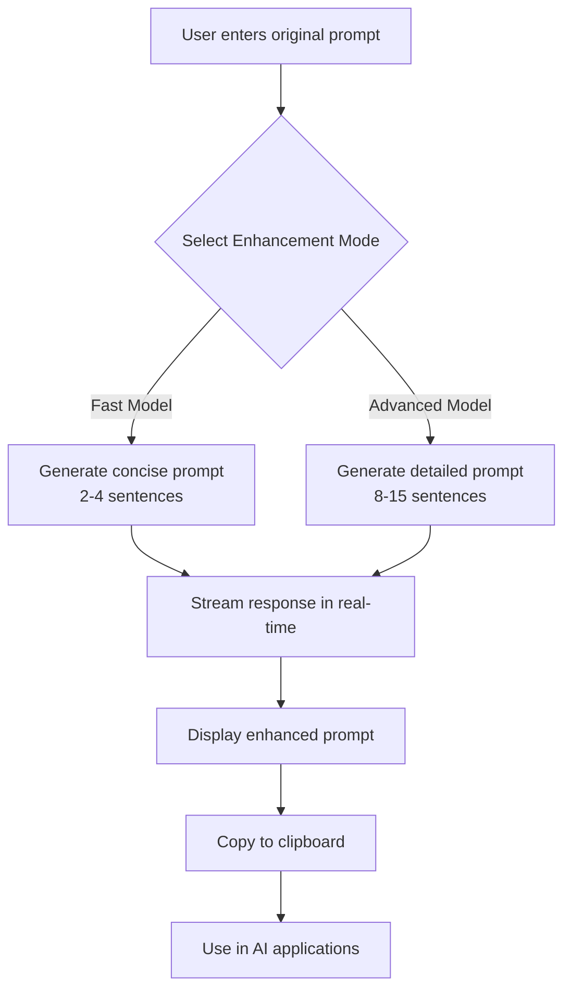
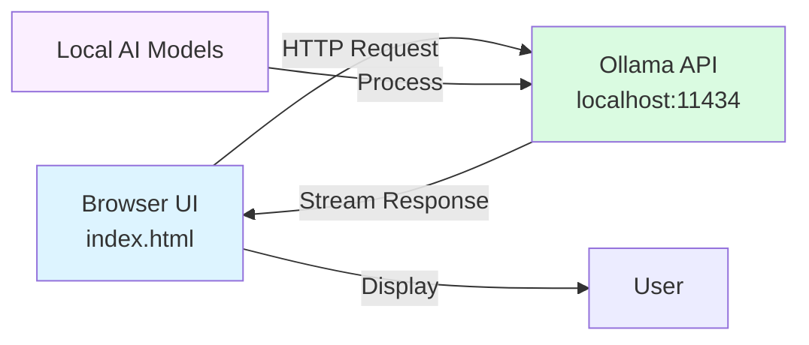
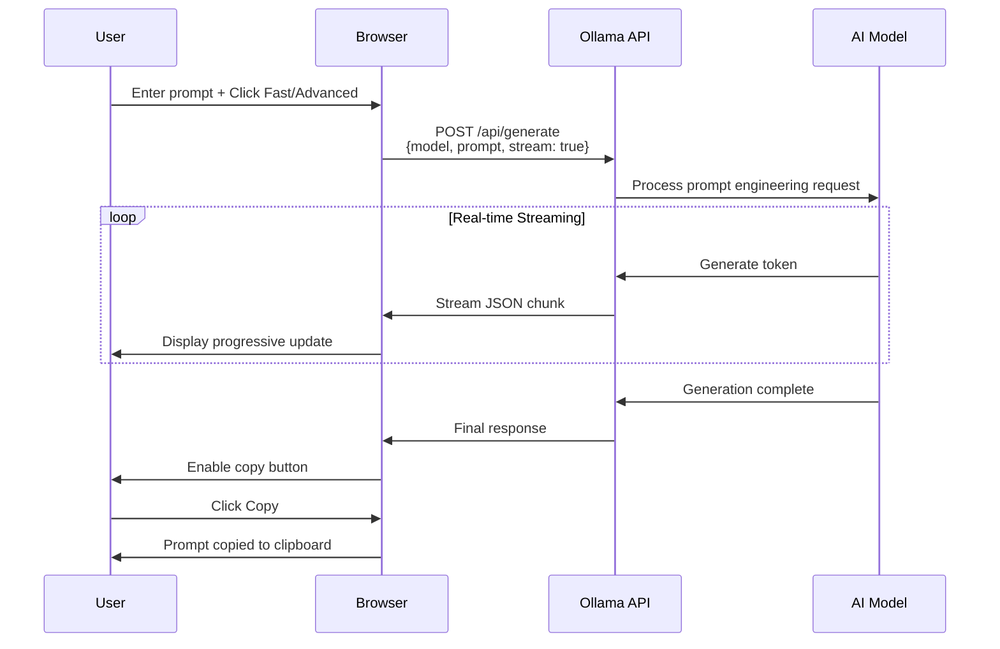

# xsukax Ollama AI Prompt Generator

A professional, privacy-focused web application that enhances your AI prompts using locally-running Ollama models with real-time streaming capabilities.


**Live Demo:** [https://xsukax.github.io/xsukax-Ollama-AI-Prompt-Generator](https://xsukax.github.io/xsukax-Ollama-AI-Prompt-Generator)

---

## 📋 Project Overview

The **xsukax Ollama AI Prompt Generator** is a sophisticated single-page web application designed to transform casual user prompts into professional, well-structured prompts optimized for AI language models. Built as a pure client-side application, it connects seamlessly to your local Ollama installation, enabling you to leverage the power of open-source AI models for prompt engineering without sending data to external servers.

The application offers two distinct enhancement modes: a **Fast Model** mode that generates concise, clear prompts (2-4 sentences) ideal for quick iterations, and an **Advanced Model** mode that produces comprehensive, detailed prompts with structured requirements and professional formatting (8-15 sentences). With real-time streaming responses, an intuitive model selection interface, and automatic connection status monitoring, this tool streamlines the prompt engineering workflow for developers, content creators, researchers, and AI enthusiasts.

Whether you're crafting prompts for creative writing, technical documentation, code generation, or analytical tasks, the xsukax Ollama AI Prompt Generator ensures your instructions are clear, specific, and optimized for maximum AI model performance—all while maintaining complete control over your data through local processing.

---

## 🔒 Security and Privacy Benefits

This application prioritizes user privacy and data security through a **100% local-first architecture** that ensures your sensitive prompts and creative ideas never leave your machine:

**Complete Local Processing:** All prompt enhancement operations are performed entirely on your local machine using your locally-installed Ollama models. The application connects exclusively to `localhost:11434`, meaning no data is transmitted to external servers, third-party APIs, or cloud services. Your prompts, enhanced outputs, and model interactions remain private and under your complete control.

**Zero Data Collection:** The application does not collect, store, or transmit any user data, analytics, telemetry, or usage statistics. There are no tracking scripts, cookies, or external dependencies beyond the Font Awesome icon library served from a CDN for UI elements. Your prompt engineering workflow remains completely anonymous and untraceable.

**No API Keys Required:** Unlike cloud-based AI services that require API keys, authentication tokens, or account credentials, this application operates without any authentication mechanism. This eliminates risks associated with key exposure, credential leaks, or unauthorized access to your AI services.

**Client-Side Architecture:** Built as a single-file HTML application with embedded CSS and JavaScript, the entire codebase is transparent and auditable. There are no hidden server-side components, databases, or backend services that could potentially log or process your data. The application can even be run offline once downloaded.

**Open Source Transparency:** Licensed under the GNU General Public License v3.0, the complete source code is publicly available for inspection, modification, and community auditing. This transparency ensures that security-conscious users and organizations can verify the application's behavior and confirm its privacy guarantees before deployment.

**CORS-Free Local Communication:** The application communicates directly with your local Ollama instance using standard HTTP requests, eliminating the need for proxy servers or intermediary services that could intercept or log your API communications.

These security features make the xsukax Ollama AI Prompt Generator particularly suitable for enterprise environments, research institutions, and privacy-conscious individuals who require complete data sovereignty while leveraging advanced AI capabilities.

---

## ✨ Features and Advantages

**🚀 Dual Enhancement Modes**
- **Fast Model Mode:** Generates concise, professional prompts (2-4 sentences) with clear role assignments and actionable requirements—perfect for rapid prompt iterations and quick refinements
- **Advanced Model Mode:** Creates comprehensive, structured prompts (8-15 sentences) with detailed deliverables, quality criteria, and professional formatting using bullet points and sections

**🔄 Real-Time Streaming Responses**
- Watch your enhanced prompts appear in real-time as the AI model generates them, with smooth streaming indicators and progress feedback
- Instant visual feedback eliminates waiting time and provides transparency into the generation process

**🎯 Intelligent Model Selection**
- Automatically detects and displays all available Ollama models installed on your system
- Easy model switching with visual indicators showing the currently selected model
- Displays model sizes to help you choose between speed and capability
- Refresh functionality to instantly detect newly downloaded models

**📋 One-Click Copy Functionality**
- Copy enhanced prompts to clipboard with a single click
- Visual confirmation feedback with success indicators
- Seamlessly integrate enhanced prompts into your workflow

**🎨 Professional User Interface**
- Clean, modern design inspired by GitHub's UI/UX principles
- Fully responsive layout that adapts to desktop, tablet, and mobile devices
- Intuitive sidebar navigation with collapsible model list
- Color-coded mode indicators (Fast: Blue, Advanced: Purple) for quick visual reference

**🔌 Connection Status Monitoring**
- Real-time connection status indicator showing Ollama availability
- Clear error messages with actionable troubleshooting guidance
- Automatic connection verification on page load

**⚡ Zero Configuration**
- No installation, configuration files, or complex setup required
- Simply open `index.html` in any modern web browser
- Works immediately after downloading—no build process or dependencies

**🌐 Universal Compatibility**
- Pure HTML/CSS/JavaScript implementation with no framework dependencies
- Compatible with all modern browsers (Chrome, Firefox, Safari, Edge)
- Can be deployed as a static website, run locally, or hosted on GitHub Pages
- Platform-independent: works on Windows, macOS, Linux, and mobile devices

**🔧 Customizable Prompt Engineering**
- Built-in prompt engineering templates optimized for two distinct use cases
- Preserves original user intent while adding professional structure
- Avoids introducing assumptions or fabricated information
- Configurable temperature and sampling parameters for fine-tuned control

**📦 Self-Contained Design**
- Single-file application (`index.html`) containing all functionality
- No external JavaScript dependencies or libraries (except Font Awesome icons for UI)
- Easy to backup, share, and version control

---

## 📥 Installation Instructions

### Prerequisites

Before using the xsukax Ollama AI Prompt Generator, ensure you have the following installed:

**1. Ollama Installation**

Download and install Ollama on your system:

- **macOS and Linux:**
  ```bash
  curl -fsSL https://ollama.com/install.sh | sh
  ```

- **Windows:**
  Download the installer from [https://ollama.com/download](https://ollama.com/download)

**2. Download AI Models**

After installing Ollama, download at least one language model. Recommended models include:

```bash
# Lightweight, fast model (recommended for Fast Mode)
ollama pull llama3.2

# More capable model (recommended for Advanced Mode)
ollama pull llama3.1

# High-performance model for best results
ollama pull mistral
```

View all available models at [https://ollama.com/library](https://ollama.com/library)

**3. Verify Ollama is Running**

Ensure Ollama is running on your system:

```bash
# Check if Ollama is running
ollama list

# Start Ollama service (if not already running)
ollama serve
```

By default, Ollama runs on `http://localhost:11434`

### Application Setup

**Option 1: Use GitHub Pages (Recommended for Quick Start)**

Simply visit the live demo at:
```
https://xsukax.github.io/xsukax-Ollama-AI-Prompt-Generator
```

**Option 2: Clone Repository**

```bash
# Clone the repository
git clone https://github.com/xsukax/xsukax-Ollama-AI-Prompt-Generator.git

# Navigate to the directory
cd xsukax-Ollama-AI-Prompt-Generator

# Open index.html in your browser
# On macOS:
open index.html
# On Linux:
xdg-open index.html
# On Windows:
start index.html
```

**Option 3: Download Standalone File**

1. Download `index.html` from the repository
2. Save it to your preferred location
3. Double-click to open in your default browser

**No Additional Configuration Required!** The application will automatically connect to your local Ollama instance at `http://localhost:11434`.

---

## 📖 Usage Guide

### Basic Workflow

The xsukax Ollama AI Prompt Generator follows a simple three-step process to enhance your prompts:



### Step-by-Step Instructions

**Step 1: Ensure Ollama is Running**

Before using the application, verify that Ollama is running locally:

```bash
# Verify Ollama is active
ollama list
```

You should see a list of your installed models. If not, start Ollama:

```bash
ollama serve
```

**Step 2: Open the Application**

Open `index.html` in your web browser. You should see a green "Connected to Ollama" indicator in the top-right corner. If you see a red indicator, check that Ollama is running on port 11434.

**Step 3: Select a Model**

In the left sidebar under "Available Models," click on your preferred model. The selected model will be highlighted in blue. Recommended model selection:

- For **Fast Mode:** Use smaller models (e.g., `llama3.2`, `phi3`)
- For **Advanced Mode:** Use larger models (e.g., `llama3.1`, `mistral`, `mixtral`)

**Step 4: Enter Your Original Prompt**

In the "Original Prompt" text area, enter the prompt you want to enhance. Examples:

- *"Write a story about a robot learning to paint"*
- *"Explain quantum computing"*
- *"Create a business plan for a coffee shop"*
- *"Debug this Python code"*

**Step 5: Choose Enhancement Mode**

Click one of the two enhancement buttons:

- **Fast Model:** For quick, concise enhancements (2-4 sentences)
- **Advanced Model:** For comprehensive, detailed prompts with structure

**Step 6: Watch Real-Time Generation**

The application will stream the enhanced prompt in real-time. You'll see:
- A "Streaming response..." indicator with an animated dot
- The enhanced text appearing progressively in the output area
- A mode indicator (Fast/Advanced) showing which enhancement was used

**Step 7: Copy and Use**

Once generation is complete, click the **Copy** button to copy the enhanced prompt to your clipboard. The button will briefly show "Copied!" to confirm success.

### Application Architecture



### System Communication Flow



### Understanding Enhancement Modes

**Fast Model Enhancement:**
- **Purpose:** Quick, concise prompt refinement
- **Output Length:** 2-4 sentences
- **Structure:** Role assignment + clear request + specific requirements
- **Best For:** Rapid iterations, simple tasks, when you need immediate results
- **Example Input:** *"Write a story about a robot"*
- **Example Output:** *"You are an experienced creative writer with expertise in science fiction and character development. Write a short story (500-800 words) about a sentient robot discovering artistic expression and the emotional journey of learning to create. Focus on vivid descriptions of the robot's internal processing and the transformative moments in its creative awakening."*

**Advanced Model Enhancement:**
- **Purpose:** Comprehensive, professional prompt creation
- **Output Length:** 8-15 sentences with structured sections
- **Structure:** Role + context + detailed requirements (bullet points) + quality criteria + deliverables
- **Best For:** Complex tasks, professional projects, detailed analysis, when precision matters
- **Example Input:** *"Write a story about a robot"*
- **Example Output:** A multi-paragraph prompt with role assignment, detailed story requirements, character development guidelines, structural expectations, quality criteria, and deliverable specifications

### Troubleshooting Common Issues

**Issue: "Cannot connect to Ollama API"**
- **Solution:** Ensure Ollama is running with `ollama serve`
- Verify Ollama is using default port 11434
- Check firewall settings aren't blocking localhost connections

**Issue: "No models found"**
- **Solution:** Download models using `ollama pull <model_name>`
- Click "Refresh Models" button after downloading
- Verify models are listed with `ollama list` in terminal

**Issue: "No response received from the model"**
- **Solution:** Check that the selected model is fully downloaded
- Try a different model from the sidebar
- Restart Ollama service

**Issue: Slow response times**
- **Solution:** Use smaller models for Fast Mode (e.g., `llama3.2`)
- Ensure your system has adequate RAM (8GB+ recommended)
- Close other resource-intensive applications

---

## 📄 License

This project is licensed under the GNU General Public License v3.0.

---

## 🤝 Contributing

Contributions are welcome! Please feel free to submit a Pull Request. For major changes, please open an issue first to discuss what you would like to change.

---

## 🙏 Acknowledgments

- Built with [Ollama](https://ollama.com/) - Run large language models locally
- Icons provided by [Font Awesome](https://fontawesome.com/)
- Inspired by modern prompt engineering best practices

---

## 📞 Support

If you encounter any issues or have questions:

- **GitHub Issues:** [https://github.com/xsukax/xsukax-Ollama-AI-Prompt-Generator/issues](https://github.com/xsukax/xsukax-Ollama-AI-Prompt-Generator/issues)
- **Ollama Documentation:** [https://github.com/ollama/ollama](https://github.com/ollama/ollama)

---

**Made with ❤️ for the open-source community**
