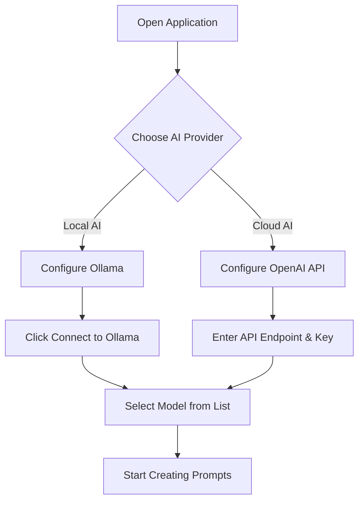
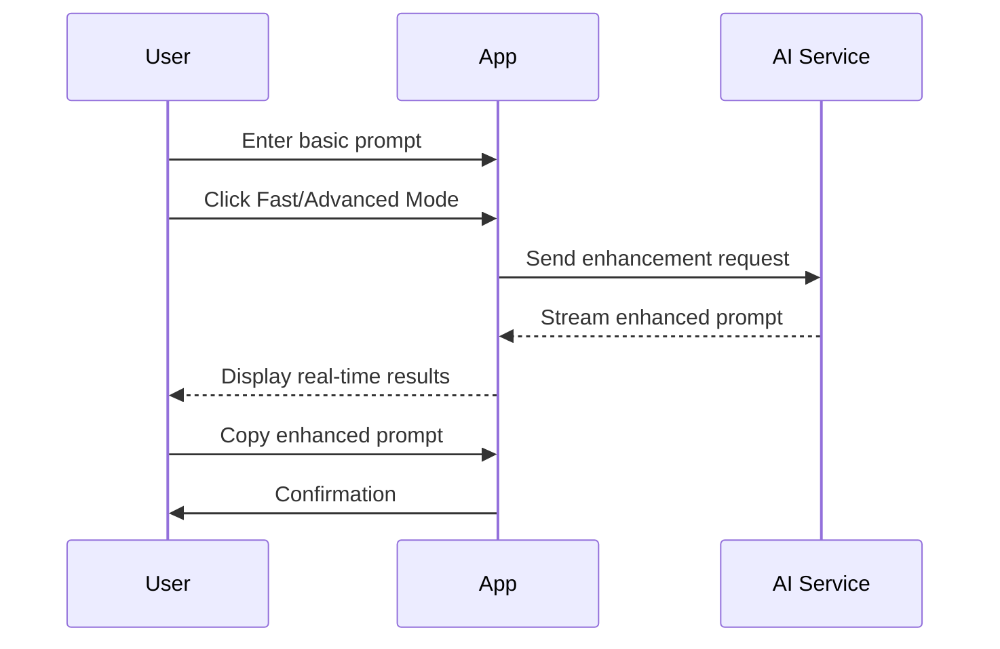
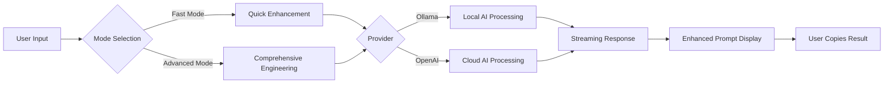

# xsukax AI Prompt Generator

[](https://www.gnu.org/licenses/gpl-3.0)
[](https://xsukax.github.io/xsukax-AI-Prompt-Generator)

A universal, client-side AI prompt engineering tool that enhances your prompts using local or cloud-based AI models. Transform basic prompts into detailed, professional-grade instructions without sending your data to third-party servers.

## 🚀 Live Demo

Try it now: [https://xsukax.github.io/xsukax-AI-Prompt-Generator](https://xsukax.github.io/xsukax-AI-Prompt-Generator)

## 📋 Project Overview

The **xsukax AI Prompt Generator** is a sophisticated web-based application designed to help users craft superior AI prompts through intelligent enhancement. By leveraging both local AI models (via Ollama) and cloud-based services (via OpenAI-compatible APIs), this tool provides two distinct modes of prompt enhancement:

- **Fast Mode**: Quickly refines and clarifies your prompts with essential improvements
- **Advanced Mode**: Performs comprehensive prompt engineering with detailed structure, context, and optimization

The application operates entirely in your browser, ensuring that your prompt ideas remain private and secure. It supports multiple AI providers and models, giving you flexibility in choosing the right tool for your prompt engineering needs.

## 🔒 Security and Privacy Benefits

This application is built with a strong commitment to user privacy and data security:

### Client-Side Architecture
All processing occurs directly in your web browser. The application is a static HTML file with embedded CSS and JavaScript, requiring no backend server or database. Your prompts and enhanced outputs never pass through intermediary servers operated by the application developer.

### Zero Data Collection
The application does not collect, store, or transmit any user data, analytics, or telemetry. There are no cookies, tracking scripts, or third-party analytics services integrated into the codebase.

### Direct API Communication
When using AI services, your browser communicates directly with the chosen API endpoint (Ollama or OpenAI-compatible services). The application acts solely as an interface, ensuring that your data flows only between your browser and the AI service you explicitly configure.

### Local Model Support
Full support for locally-hosted AI models via Ollama enables completely offline operation. When using local models, your prompts never leave your machine, providing maximum privacy for sensitive or proprietary work.

### Transparent Configuration
All API endpoints and keys are configurable by the user and stored only in browser's localStorage on your own device. You maintain complete control over which services are used and how they are accessed.

### Open Source Transparency
The entire application source code is available for inspection on GitHub. Users can audit the code to verify security claims and ensure no hidden data exfiltration mechanisms exist.

### No Authentication Required
The application requires no user accounts, registrations, or personal information. Simply open the page and start using it immediately.

## ✨ Features and Advantages

### Multi-Provider Support
- **Ollama Integration**: Connect to locally-hosted Ollama instances for complete privacy and offline functionality
- **OpenAI-Compatible APIs**: Support for OpenAI, Azure OpenAI, or any OpenAI-compatible endpoint
- **Flexible Configuration**: Easy switching between providers and models through an intuitive interface

### Dual Enhancement Modes
- **Fast Mode**: Quick prompt refinement focusing on clarity, structure, and conciseness
- **Advanced Mode**: Deep prompt engineering with comprehensive context, examples, constraints, and optimization techniques

### Real-Time Streaming
Experience live generation of enhanced prompts with streaming responses, providing immediate feedback and allowing you to stop generation at any point.

### Intelligent Model Detection
Automatically detects available models from connected Ollama instances, displaying model names and sizes for informed selection.

### User-Friendly Interface
- Clean, modern GitHub-inspired design
- Responsive layout that works seamlessly on desktop and mobile devices
- Real-time status indicators for API connections
- One-click copy functionality for enhanced prompts
- Expandable provider configuration sections

### Production-Ready Reliability
- Comprehensive error handling with user-friendly messages
- Request cancellation support to abort long-running operations
- Connection status monitoring for both Ollama and OpenAI services
- Preset endpoint configurations for common setups

### Complete Privacy Control
- No external dependencies beyond optional AI service APIs
- All data processing occurs client-side
- No tracking, analytics, or data collection
- Compatible with air-gapped environments when using local models

## 📥 Installation Instructions

### Option 1: GitHub Pages Deployment (Recommended)

1. **Fork this repository** to your GitHub account
2. Navigate to repository **Settings** → **Pages**
3. Under "Source", select the branch containing `index.html` (usually `main` or `master`)
4. Click **Save**
5. Your application will be available at `https://[your-username].github.io/xsukax-AI-Prompt-Generator`

### Option 2: Local Deployment

1. **Clone the repository**:
   ```bash
   git clone https://github.com/xsukax/xsukax-AI-Prompt-Generator.git
   cd xsukax-AI-Prompt-Generator
   ```

2. **Open the application**:
   - Simply open `index.html` in any modern web browser
   - Or use a local web server:
     ```bash
     # Using Python 3
     python -m http.server 8000
     
     # Using PHP
     php -S localhost:8000
     
     # Using Node.js (http-server)
     npx http-server -p 8000
     ```
   - Navigate to `http://localhost:8000` in your browser

### Option 3: Direct Usage

Simply download `index.html` from this repository and open it directly in your web browser. No installation required.

## 🛠️ Usage Guide

### Initial Setup



### Configuring Ollama (Local AI)

1. **Install Ollama** on your system from [ollama.ai](https://ollama.ai)
2. **Pull a model**: `ollama pull llama2` (or any preferred model)
3. **Start Ollama**: It typically runs on `http://localhost:11434`
4. In the application:
   - Expand the "Ollama (Local)" configuration section
   - Verify the endpoint URL (default: `http://localhost:11434`)
   - Click **"Connect to Ollama"**
   - Select your desired model from the auto-populated list

**Common Ollama Endpoints:**
- Local: `http://localhost:11434`
- Remote: `http://your-server-ip:11434`

### Configuring OpenAI-Compatible APIs

1. In the application, expand the "OpenAI API" configuration section
2. **Enter API Endpoint**:
   - OpenAI: `https://api.openai.com/v1`
   - Azure OpenAI: `https://your-resource.openai.azure.com/openai/deployments/your-deployment`
   - Other compatible services: Use their documented endpoint
3. **Enter API Key**: Your authentication key for the service
4. **Enter Model Name**: Specific model identifier (e.g., `gpt-4`, `gpt-3.5-turbo`)
5. Click **"Connect to OpenAI"** to verify the configuration

### Creating Enhanced Prompts



1. **Enter Your Basic Prompt**: Type your initial prompt idea in the "Your Prompt" text area
   - Example: "Create a marketing email"

2. **Choose Enhancement Mode**:
   - **Fast Mode**: Click the blue "🚀 Fast Mode" button for quick refinement
   - **Advanced Mode**: Click the purple "⚡ Advanced Mode" button for comprehensive engineering

3. **Review the Enhanced Result**: The enhanced prompt appears in the "Enhanced Prompt" area with real-time streaming

4. **Copy the Result**: Click the "Copy" button to copy the enhanced prompt to your clipboard

### Understanding Enhancement Modes

#### Fast Mode
Focuses on:
- Clarifying ambiguous language
- Adding essential structure
- Removing redundancy
- Improving conciseness
- Maintaining the original intent

**Best for**: Quick improvements, iterative refinement, simple tasks

#### Advanced Mode
Provides:
- Comprehensive context and background
- Detailed step-by-step instructions
- Specific examples and templates
- Explicit constraints and requirements
- Output format specifications
- Edge case handling
- Quality criteria

**Best for**: Complex tasks, production use, detailed requirements, critical applications

### Workflow Architecture



### Advanced Tips

- **Model Selection**: Larger models (70B+) typically produce more sophisticated prompts but require more processing time
- **Iterative Enhancement**: Run Fast Mode first, then use Advanced Mode on the result for maximum refinement
- **Custom Endpoints**: The application supports any OpenAI-compatible API, including self-hosted solutions
- **Offline Operation**: When using Ollama with local models, the application works completely offline
- **Multiple Attempts**: Don't hesitate to regenerate if the first result doesn't meet your needs

### Troubleshooting

**Ollama Connection Failed**
- Ensure Ollama is running: `ollama serve`
- Check the endpoint URL matches your Ollama instance
- Verify CORS settings if accessing from a different origin
- For remote Ollama: Ensure the server allows connections from your IP

**OpenAI API Errors**
- Verify your API key is correct and has sufficient credits
- Check that the model name exactly matches your deployment
- Ensure the endpoint URL is complete and correctly formatted
- Review rate limits and quota restrictions

**Empty Model List**
- Confirm successful connection to the provider
- For Ollama: Ensure at least one model is pulled (`ollama list`)
- Click the "Refresh Models" button after pulling new models

## 📄 License

This project is licensed under the GNU General Public License v3.0.

## 🤝 Contributing

Contributions are welcome! Please feel free to submit issues, fork the repository, and create pull requests for any improvements.

## 💡 Tips for Best Results

1. **Be Specific in Your Input**: Even basic prompts benefit from some specificity about your end goal
2. **Use Fast Mode for Exploration**: Quickly test different prompt directions before committing to detailed engineering
3. **Combine Modes**: Use Fast Mode output as input for Advanced Mode for maximum refinement
4. **Choose Appropriate Models**: Larger, more capable models produce better prompt engineering results
5. **Review and Customize**: Enhanced prompts are starting points—tailor them to your specific needs

## 🔗 Resources

- **Repository**: [https://github.com/xsukax/xsukax-AI-Prompt-Generator](https://github.com/xsukax/xsukax-AI-Prompt-Generator)
- **Live Demo**: [https://xsukax.github.io/xsukax-AI-Prompt-Generator](https://xsukax.github.io/xsukax-AI-Prompt-Generator)
- **Ollama**: [https://ollama.ai](https://ollama.ai)
- **OpenAI API**: [https://platform.openai.com](https://platform.openai.com)

## 📧 Support

If you encounter issues or have questions, please [open an issue](https://github.com/xsukax/xsukax-AI-Prompt-Generator/issues) on GitHub.

---

**Built with ❤️ for the AI community** | **Privacy-First** | **No Data Collection** | **100% Open Source**
